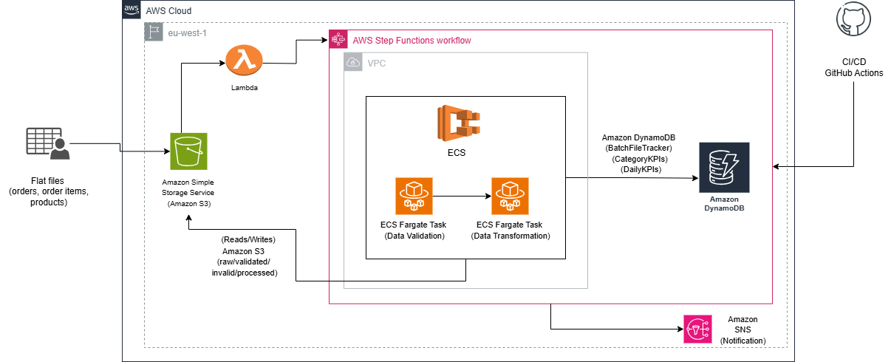
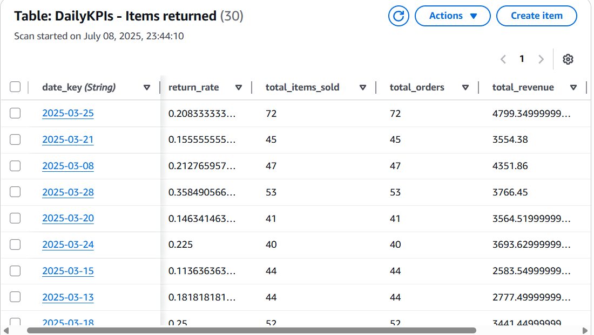

# Real-Time Event-Driven Data Pipeline for E-Commerce Analytics

This documentation outlines a robust, real-time, event-driven data pipeline for an e-commerce platform. It leverages AWS-native services to automate the ingestion, validation, transformation, and storage of transactional data, providing near real-time Key Performance Indicators (KPIs) for operational analytics.

## Table of Contents

1. [Project Objective](#1-project-objective)
2. [Architecture Overview](#2-architecture-overview)
3. [Data Format and Structure](#3-data-format-and-structure)
4. [Data Validation Rules](#4-data-validation-rules)
5. [DynamoDB Schema](#5-dynamodb-schema)
6. [Step Function Logic](#6-step-function-logic)
7. [Simulation Steps](#7-simulation-steps)

---

## 1. Project Objective

The primary objective is to establish an automated, scalable data pipeline that processes incoming e-commerce data files (products, orders, order items) in near real-time. Key goals include:

- **Automated Ingestion**: Detect new data files arriving in Amazon S3
- **Data Quality Assurance**: Validate incoming data for structural integrity and completeness using containerized services
- **KPI Generation**: Transform validated raw data into actionable business Key Performance Indicators (KPIs)
- **Real-time Accessibility**: Store computed KPIs in Amazon DynamoDB for low-latency querying and operational dashboards
- **Workflow Orchestration**: Automate the entire data flow, including error handling and retries, using AWS Step Functions
- **Operational Visibility**: Implement comprehensive logging and alerting mechanisms

---

## 2. Architecture Overview

The pipeline operates on an event-driven paradigm, initiated by new file uploads to S3.

### Architecture Diagram



### Core AWS Services Utilized

| Service | Purpose |
|---------|---------|
| **Amazon S3** | Scalable object storage for raw, validated, invalid, and processed files |
| **AWS Lambda** | Serverless compute for S3 event handling and intelligent batch coordination |
| **Amazon ECS/Fargate** | Container orchestration for running data validation and transformation tasks without server management |
| **AWS Step Functions** | State machine for orchestrating the multi-step workflow, managing state, retries, and error paths |
| **Amazon DynamoDB** | High-performance NoSQL database for real-time KPI storage and batch metadata tracking |
| **Amazon CloudWatch** | Centralized logging and monitoring for all pipeline components |
| **Amazon SNS** | Notification service for critical pipeline failures |

---

## 3. Data Format and Structure

Incoming data files are expected in CSV format and are uploaded to the `raw/` prefix within the designated S3 bucket.

### S3 File Structure and Naming Convention

To support robust batching and incremental processing, orders and order_items files are ideally organized into date-partitioned subfolders.

**Products (Static Master Data):**
```
s3://[YOUR_BUCKET_NAME]/raw/products/products.csv
```

**Orders (Daily Batches):**
```
s3://[YOUR_BUCKET_NAME]/raw/orders/YYYY-MM-DD/orders_partX.csv
```
Example: `raw/orders/2025-07-09/orders_part1.csv`

**Order Items (Daily Batches):**
```
s3://[YOUR_BUCKET_NAME]/raw/order_items/YYYY-MM-DD/order_items_partY.csv
```
Example: `raw/order_items/2025-07-09/order_items_part1.csv`

> **Note:** The Lambda trigger is designed to automatically assign the current UTC date as the batch ID if orders or order_items files are uploaded without the YYYY-MM-DD folder structure (e.g., directly into `raw/orders/`). While this provides flexibility, adhering to the date-partitioned structure is recommended for clearer data organization and historical traceability.

### Required Columns per Dataset

The validation process strictly checks for the presence of these columns:

| Dataset | Required Columns |
|---------|------------------|
| **products** | `id`, `sku`, `cost`, `category`, `retail_price` |
| **orders** | `order_id`, `user_id`, `created_at` |
| **order_items** | `order_id`, `product_id`, `sale_price` |

---

## 4. Data Validation Rules

The `ecommerce-validation-task` (an ECS Fargate container) performs the following data quality checks:

### Validation Process

1. **Header Presence**: Ensures that the incoming CSV file is not empty and contains at least a header row
2. **Required Column Check**: Verifies that all columns listed in the "Required Columns per Dataset" table are present in the uploaded file. If any are missing, the file is rejected
3. **Null Value Check (Sample-Based)**: Inspects a sample of rows (defaulting to the first 100 rows) within the required columns to identify any null or empty values. If critical nulls are found, the file is rejected

### File Movement on Validation

**Success:**
- Validated files are moved from `raw/` to `validated/`
- Example: `s3://[YOUR_BUCKET_NAME]/validated/orders/YYYY-MM-DD/orders_partX.csv`

**Failure:**
- Rejected files are moved from `raw/` to `invalid/`
- Example: `s3://[YOUR_BUCKET_NAME]/invalid/orders/orders_partX.csv`
- A companion JSON file is also uploaded to `invalid/` detailing the specific reason for rejection

**Exit Codes:**
- The validation task exits with `0` (success) or a non-zero code (failure) to signal the outcome to AWS Step Functions

---

## 5. DynamoDB Schema

The pipeline utilizes three DynamoDB tables, each with a specific schema designed for efficient data storage and retrieval.

### BatchFileTracker Table

This table is crucial for the Lambda function to coordinate file arrivals and determine when a complete batch of data is ready for processing by Step Functions.

**Purpose:** Tracks the ingestion status of products, orders, and order_items files for a given logical batch (daily data or the static products file).

**Primary Key:**
- **Partition Key:** `BatchId` (String)
  - Values: `products_master_data` (for the static products file) or `YYYY-MM-DD` (for daily orders/order items batches, e.g., `2025-07-09`)

**Attributes:**
- `products_key` (String): S3 key of the products.csv file
- `orders_keys` (List of Strings): List of S3 keys for all orders files belonging to this batch
- `order_items_keys` (List of Strings): List of S3 keys for all order_items files belonging to this batch
- `products_file_arrived` (Boolean): Flag indicating if products.csv has been processed
- `orders_files_arrived` (Boolean): Flag indicating if all expected orders files for the batch have arrived
- `order_items_files_arrived` (Boolean): Flag indicating if all expected order_items files for the batch have arrived
- `step_function_triggered` (Boolean): Flag indicating if the Step Functions workflow has been initiated for this batch
- `last_updated` (String): ISO 8601 timestamp of the last update to the item
- `status` (String): Current status of the batch (e.g., `IN_PROGRESS`, `TRIGGERED`)

### CategoryKPIs Table

Stores aggregated daily KPIs at the product category level.

**Purpose:** Provides insights into the performance of individual product categories over time.

**Primary Key:**
- **Partition Key:** `category_id` (String)
- **Sort Key:** `date_key` (String, format YYYY-MM-DD)

**Attributes:**
- `daily_revenue` (Number): Total revenue generated by the category on date_key
- `avg_order_value` (Number): Average value of orders within the category on date_key
- `avg_return_rate` (Number): Percentage of returned items/orders for the category on date_key

**Results Table:**



### DailyKPIs Table

Stores aggregated daily KPIs at the overall order level.

**Purpose:** Provides a high-level summary of daily e-commerce operational metrics.

**Primary Key:**
- **Partition Key:** `date_key` (String, format YYYY-MM-DD)

**Attributes:**
- `total_orders` (Number): Count of unique orders on date_key
- `total_revenue` (Number): Total revenue from all orders on date_key
- `total_items_sold` (Number): Total number of items sold on date_key
- `return_rate` (Number): Percentage of orders that were returned on date_key
- `unique_customers` (Number): Count of distinct customers who placed orders on date_key


---

## 6. Step Function Logic

The AWS Step Functions state machine (`ecommerce-pipeline-workflow`) defines the precise flow and orchestration of the data processing tasks.

### State Machine Definition

```json
{
  "Comment": "Real-time e-commerce KPI pipeline using ECS Fargate",
  "StartAt": "ValidateData",
  "States": {
    "ValidateData": {
      "Type": "Task",
      "Resource": "arn:aws:states:::ecs:runTask.sync",
      "Parameters": {
        "LaunchType": "FARGATE",
        "Cluster": "ecommerce-cluster",
        "TaskDefinition": "ecommerce-validation-task",
        "NetworkConfiguration": { "/* ... VPC details ... */" },
        "Overrides": {
          "ContainerOverrides": [
            {
              "Name": "validation",
              "Environment": [
                { "Name": "S3_BUCKET", "Value.$": "$.bucket" },
                { "Name": "PRODUCTS_KEY", "Value.$": "$.products_key" },
                { "Name": "ORDERS_KEYS", "Value.$": "States.JsonToString($.orders_keys)" },
                { "Name": "ORDER_ITEMS_KEYS", "Value.$": "States.JsonToString($.order_items_keys)" }
              ]
            }
          ]
        }
      },
      "InputPath": "$",
      "ResultPath": "$.validation",
      "Retry": [ "/* ... retry configuration ... */" ],
      "Catch": [
        { "ErrorEquals": ["States.ALL"], "Next": "PublishValidationFailureNotification", "ResultPath": "$.error" }
      ],
      "TimeoutSeconds": 120,
      "Next": "CheckValidationResult"
    },
    "CheckValidationResult": {
      "Type": "Choice",
      "Choices": [
        { "Variable": "$.validation.Containers[0].ExitCode", "NumericEquals": 0, "Next": "TransformData" }
      ],
      "Default": "PublishValidationFailureNotification"
    },
    "PublishValidationFailureNotification": {
      "Type": "Task",
      "Resource": "arn:aws:states:::sns:publish",
      "Parameters": {
        "TopicArn": "arn:aws:sns:[YOUR_REGION]:[YOUR_ACCOUNT_ID]:ecommerce-pipeline-alerts",
        "Message": { "Input.$": "$", "ErrorDetails.$": "$.error" },
        "Subject": "E-commerce Pipeline Alert: Validation Failed"
      },
      "Next": "ValidationFailed"
    },
    "TransformData": {
      "Type": "Task",
      "Resource": "arn:aws:states:::ecs:runTask.sync",
      "Parameters": {
        "LaunchType": "FARGATE",
        "Cluster": "ecommerce-cluster",
        "TaskDefinition": "ecommerce-transformation-task",
        "NetworkConfiguration": { "/* ... VPC details ... */" },
        "Overrides": {
          "ContainerOverrides": [
            {
              "Name": "transformation",
              "Environment": [
                { "Name": "S3_BUCKET", "Value.$": "$.bucket" },
                { "Name": "PRODUCTS_KEY", "Value.$": "$.products_key" },
                { "Name": "ORDERS_KEYS", "Value.$": "States.JsonToString($.orders_keys)" },
                { "Name": "ORDER_ITEMS_KEYS", "Value.$": "States.JsonToString($.order_items_keys)" }
              ]
            }
          ]
        }
      },
      "InputPath": "$",
      "ResultPath": "$.transformation",
      "Retry": [ "/* ... retry configuration ... */" ],
      "Catch": [
        { "ErrorEquals": ["States.ALL"], "Next": "PublishTransformationFailureNotification", "ResultPath": "$.error" }
      ],
      "TimeoutSeconds": 300,
      "End": true
    },
    "PublishTransformationFailureNotification": {
      "Type": "Task",
      "Resource": "arn:aws:states:::sns:publish",
      "Parameters": {
        "TopicArn": "arn:aws:sns:[YOUR_REGION]:[YOUR_ACCOUNT_ID]:ecommerce-pipeline-alerts",
        "Message": { "Input.$": "$", "ErrorDetails.$": "$.error" },
        "Subject": "E-commerce Pipeline Alert: Transformation Failed"
      },
      "Next": "TransformationFailed"
    },
    "ValidationFailed": { 
      "Type": "Fail", 
      "Error": "ValidationError", 
      "Cause": "Data validation task failed." 
    },
    "TransformationFailed": { 
      "Type": "Fail", 
      "Error": "TransformationError", 
      "Cause": "Data transformation task failed." 
    }
  }
}
```

### Key Aspects of Step Function Logic

**Input Parameters:**
- The Step Function expects an input JSON containing `bucket`, `products_key`, `orders_keys` (list), and `order_items_keys` (list)
- These are passed from the AWS Lambda trigger

**ValidateData Task:**
- Invokes the `ecommerce-validation-task` ECS Fargate task
- Passes S3 paths as environment variables to the container
- Configured with Retry policies for transient failures
- Includes a Catch block to handle any errors during validation, redirecting to an SNS notification
- TimeoutSeconds: Prevents tasks from running indefinitely

**CheckValidationResult Choice State:**
- Examines the ExitCode of the ValidateData ECS task
- If ExitCode is 0 (success), it proceeds to TransformData
- If ExitCode is non-zero (failure), it defaults to PublishValidationFailureNotification

**PublishValidationFailureNotification Task:**
- Publishes a message to an SNS topic (`ecommerce-pipeline-alerts`) to alert on validation failures
- The message includes the original input and error details

**TransformData Task:**
- Invokes the `ecommerce-transformation-task` ECS Fargate task
- Passes S3 paths (now referring to `validated/` prefix) as environment variables
- Also configured with Retry and Catch policies

**PublishTransformationFailureNotification Task:**
- Similar to the validation notification, sends an SNS alert for transformation failures

**ValidationFailed and TransformationFailed Fail States:**
- Explicitly terminate the workflow on unrecoverable errors
- Provide clear error types and causes in the Step Functions execution history

---

## 7. Simulation Steps

Follow these steps to manually simulate and test the pipeline's functionality.

### Step 1: Ensure All AWS Resources are Deployed

**S3 Bucket:**
- Create bucket: `ecommerce-event-pipeline` (or your chosen bucket name)

**DynamoDB Tables:**
- `BatchFileTracker` (Partition Key: `BatchId` (String), No Sort Key)
- `CategoryKPIs` (Partition Key: `category_id` (String), Sort Key: `date_key` (String))
- `DailyKPIs` (Partition Key: `date_key` (String), No Sort Key)

**AWS Lambda Function:**
- Function name: `trigger-ecommerce-kip-pipeline`
- Environment Variables:
  - `PIPELINE_BATCH_TRACKER_TABLE`: Set to `BatchFileTracker`
  - `STEP_FUNCTION_ARN`: Set to the ARN of your Step Functions state machine
- IAM Role: Ensure the Lambda's execution role has permissions for:
  - `s3:GetObject`, `s3:PutObject` (for logs)
  - `dynamodb:UpdateItem`, `dynamodb:GetItem` on BatchFileTracker table
  - `states:StartExecution` on your Step Functions state machine

**Amazon ECS:**
- Cluster, Task Definitions (`ecommerce-validation-task`, `ecommerce-transformation-task`)
- Associated IAM roles for ECS tasks (with S3 read/write and DynamoDB write permissions)

**AWS Step Functions State Machine:**
- State machine: `ecommerce-pipeline-workflow`
- Ensure Cluster and TaskDefinition names match your ECS setup
- Verify TopicArn for SNS notifications is correct

### Step 2: Initial File Upload (Products Master Data)

Upload your `products.csv` file to:
```
s3://[YOUR_BUCKET_NAME]/raw/products/products.csv
```

**Observe Lambda Logs:**
Monitor the CloudWatch Logs for the `trigger-ecommerce-kip-pipeline` Lambda. You should see:
```
[INFO] Processing incoming file: s3://[YOUR_BUCKET_NAME]/raw/products/products.csv for Batch ID: products_master_data
[INFO] Updated DynamoDB for Batch ID products_master_data with products file.
[INFO] Products master data batch updated. No Step Function trigger from this file directly.
```

**Verify DynamoDB:**
Check the `BatchFileTracker` table in the DynamoDB console. You should find an item with:
- `BatchId`: `"products_master_data"`
- `products_file_arrived`: `True`

### Step 3: Upload Daily Batch Files (Orders & Order Items)

Upload your files to:
- Orders: `s3://[YOUR_BUCKET_NAME]/raw/orders/`
- Order Items: `s3://[YOUR_BUCKET_NAME]/raw/order_items/`

If you use date-partitioned folders (e.g., `raw/orders/2025-07-09/orders_part1.csv`), the Lambda will use that date. Otherwise, it will default to the current UTC date.

**Example uploads:**
```
s3://[YOUR_BUCKET_NAME]/raw/orders/orders_part1.csv
s3://[YOUR_BUCKET_NAME]/raw/order_items/order_items_part1.csv
```

**Observe Lambda Logs:**
For each file upload, you should see:
```
[WARN] No date partition found in key raw/orders/orders_partX.csv. Assigning current UTC date YYYY-MM-DD as Batch ID.
[INFO] Processing incoming file: s3://[YOUR_BUCKET_NAME]/raw/orders/orders_partX.csv for Batch ID: YYYY-MM-DD
[INFO] Updated DynamoDB for Batch ID YYYY-MM-DD with orders file.
[DEBUG] Global Products Master Data status: Ready=True, Key=raw/products/products.csv
[DEBUG] Daily Batch YYYY-MM-DD status: Orders=[True/False], Items=[True/False], Triggered=False
[INFO] Daily Batch ID YYYY-MM-DD not yet complete, or Products Master Data not ready, or already triggered. Waiting for more files.
```

### Step 4: Triggering Step Functions

Once all required files for a given `YYYY-MM-DD` batch have been uploaded and processed by the Lambda, the Lambda will log:
```
[INFO] All required files for Daily Batch ID YYYY-MM-DD and Products Master Data are ready. Preparing to trigger Step Function.
[INFO] Triggering Step Function with input: { ... full payload ... }
[INFO] Step Function triggered for Daily Batch ID YYYY-MM-DD.
[INFO] Marked Daily Batch ID YYYY-MM-DD as triggered in DynamoDB.
```

### Step 5: Monitor Step Functions Execution

- Go to the AWS Step Functions console
- Navigate to your `ecommerce-pipeline-workflow` state machine
- Monitor the new execution through the `ValidateData` and `TransformData` steps
- Check the associated CloudWatch Logs for the ECS tasks for detailed output

### Step 6: Verify Data in S3

After successful Step Functions execution:

**Check validated files:**
- `s3://[YOUR_BUCKET_NAME]/validated/`: Files should temporarily appear here after validation

**Check processed files:**
- `s3://[YOUR_BUCKET_NAME]/processed/`: Files should be moved here after successful transformation

**Check invalid files:**
- `s3://[YOUR_BUCKET_NAME]/invalid/`: If you upload malformed files, they will appear here with a `_reason.json` file

**Check logs:**
- `s3://[YOUR_BUCKET_NAME]/logs/validation/` and `s3://[YOUR_BUCKET_NAME]/logs/transformation/`: Should contain detailed log files from your ECS tasks

### Step 7: Verify KPIs in DynamoDB

- Query your `CategoryKPIs` and `DailyKPIs` tables in the DynamoDB console
- Confirm that the computed KPIs for the processed dates are present and correctly structured

### Step 8: Test Failure Paths (Optional but Recommended)

**Test validation failure:**
1. Upload a malformed `orders_partX.csv` file (e.g., delete the `order_id` column or introduce nulls in `created_at`)
2. Observe the Lambda logs (it should still process the event)
3. Observe the Step Functions execution: It should proceed to `ValidateData`, fail, and then trigger the SNS notification
4. Check `s3://[YOUR_BUCKET_NAME]/invalid/` to confirm the rejected file and its reason
5. Check your SNS subscription for the alert

---

## Summary

This real-time, event-driven data pipeline provides a robust solution for processing e-commerce data with automated validation, transformation, and KPI generation. The architecture ensures scalability, reliability, and real-time insights for operational decision-making.